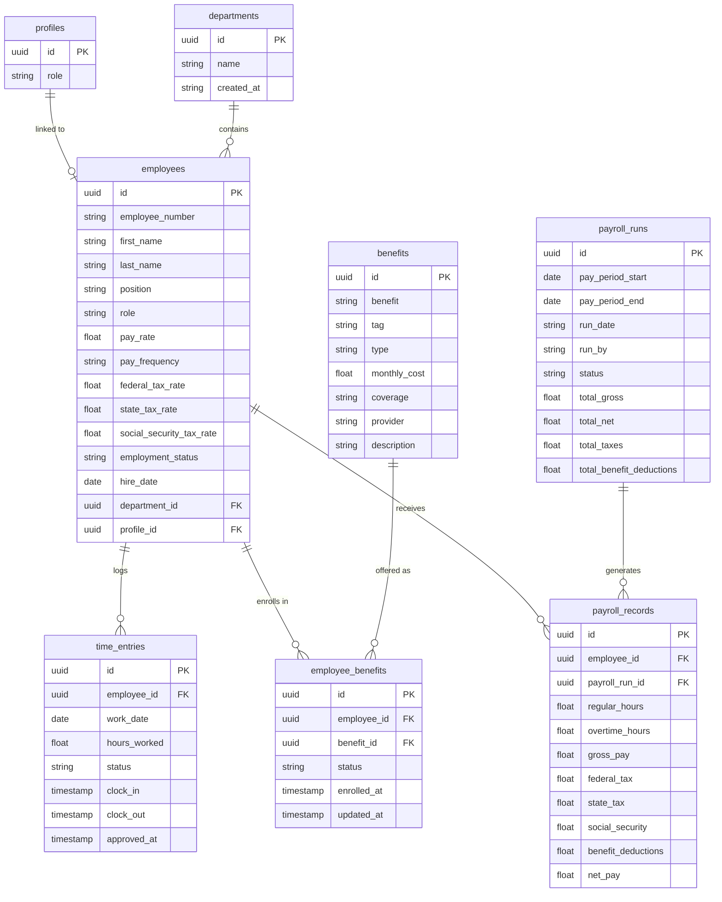

# PayCore

A full-stack payroll management web application built with Next.js, React 19, Supabase, and TailwindCSS. PayCore supports two roles — **Manager** and **Employee** — with role-based routing, payroll processing, time entry approvals, and benefits management.

---

## Tech Stack

| Layer | Technology |
|---|---|
| Framework | Next.js 16 (App Router) |
| Language | TypeScript |
| Database / Auth | Supabase (PostgreSQL + RLS) |
| Styling | TailwindCSS v4 + shadcn/ui |
| Testing | Vitest + React Testing Library |

---

## Getting Started

```bash
npm install
npm run dev
```

Open [http://localhost:3000](http://localhost:3000). Log in as a Manager or Employee — the app routes you to the correct dashboard automatically based on your role.

### Environment Variables

Create a `.env.local` file in the project root:

```env
NEXT_PUBLIC_SUPABASE_URL=your_supabase_url
NEXT_PUBLIC_SUPABASE_PUBLISHABLE_DEFAULT_KEY=your_supabase_publishable_key
```

---

## Project Structure

```bash
paycore/
├── app/                            # Next.js App Router pages
│   ├── page.tsx                    # Login page — authenticates user and routes by role
│   ├── layout.tsx                  # Root layout with ThemeProvider and NavbarWrapper
│   ├── providers.tsx               # App-wide context providers
│   ├── theme-provider.tsx          # Dark/light mode provider (next-themes)
│   ├── navbar-wrapper.tsx          # Conditionally renders manager or employee navbar
│   │
│   ├── manager/                    # All manager-facing pages
│   │   ├── dashboard/page.tsx      # Manager dashboard with stat cards and charts
│   │   ├── employee-table/page.tsx # Table of all employees
│   │   ├── payroll-records-table/  # Payroll records viewer with Run Payroll dialog
│   │   │   └── page.tsx
│   │   ├── payroll-status/         # Payroll run progress/result page
│   │   │   ├── page.tsx
│   │   │   └── types.ts
│   │   ├── benefits/               # Benefits management section
│   │   │   ├── page.tsx
│   │   │   ├── types.ts
│   │   │   ├── constant.ts
│   │   │   ├── data.ts
│   │   │   ├── company-benefits/benefits.tsx
│   │   │   ├── optional-benefits/benefits.tsx
│   │   │   └── summary-cards/cards.tsx
│   │   ├── stat-cards/             # Dashboard KPI cards (total employees, payroll, etc.)
│   │   │   ├── cards.tsx
│   │   │   └── types.ts
│   │   └── grid-content/           # Dashboard grid layout and chart cards
│   │       ├── grid-content.tsx
│   │       └── grid-cards/
│   │           ├── payroll-chart.tsx
│   │           ├── salary-distribution-chart.tsx
│   │           ├── team-distribution.tsx
│   │           ├── recent-activity.tsx
│   │           ├── quick-actions-card.tsx
│   │           ├── upcoming-tasks.tsx
│   │           └── types.ts
│   │
│   └── employee/                   # All employee-facing pages
│       ├── dashboard/page.tsx      # Employee dashboard
│       ├── benefits/               # Benefit enrollment and coverage summary
│       │   ├── page.tsx
│       │   ├── types.ts
│       │   ├── constants.ts
│       │   ├── summary-cards/page.tsx
│       │   ├── progress-bar/page.tsx
│       │   ├── company-benefits-cards/page.tsx
│       │   ├── optional-benefits-cards/page.tsx
│       │   └── important-info-card/page.tsx
│       ├── paystubs/               # Pay stub history with earnings/deductions breakdown
│       │   ├── page.tsx
│       │   └── types.ts
│       ├── stat_cards/             # Dashboard KPI cards (weekly hours, targets)
│       │   ├── page.tsx
│       │   └── types.ts
│       └── grid-content/           # Charts, timesheets, and weekly hours
│           └── grid-cards/
│               ├── quick-stats-card.tsx
│               ├── recent-timesheets-card.tsx
│               ├── weekly-hours-card.tsx
│               ├── ytd-earnings-card.tsx
│               └── types.ts
│
├── components/                     # Reusable React components
│   ├── SplitText.tsx               # GSAP-powered text split animation
│   ├── ui/                         # shadcn/ui component library
│   │   ├── badge.tsx
│   │   ├── button.tsx
│   │   ├── card.tsx
│   │   ├── chart.tsx
│   │   ├── dialog.tsx
│   │   ├── dropdown-menu.tsx
│   │   ├── input.tsx
│   │   ├── label.tsx
│   │   ├── select.tsx
│   │   ├── separator.tsx
│   │   ├── spinner.tsx
│   │   ├── table.tsx
│   │   ├── textarea.tsx
│   │   └── navbars/
│   │       ├── manager-navbar.tsx  # Navigation bar for managers
│   │       └── employee-navbar.tsx # Navigation bar for employees
│   └── animate-ui/                 # Animated UI component extensions
│       ├── components/buttons/     # Animated button variants
│       └── primitives/             # Base animation primitives (slots, particles, toggles)
│
├── lib/                            # Core business logic
│   ├── supabase/                   # Supabase query functions and server actions
│   │   ├── payroll.tsx             # calculatePayRollForEmployee + client-side DB fetches
│   │   ├── payroll-actions.ts      # Server action — runPayroll orchestration
│   │   ├── employee.tsx            # Employee CRUD + getCurrentEmployee
│   │   ├── benefits.ts             # Benefits CRUD + employee enrollment
│   │   ├── paystubs.ts             # Employee paystub queries
│   │   └── time-entries.ts         # Time entry creation and fetching
│   ├── utils.ts                    # General utility functions (cn, formatPayPeriod, etc.)
│   ├── get-strict-context.tsx      # Type-safe React context factory
│   └── interfaces/
│       └── database.types.ts       # Auto-generated Supabase DB types
│
├── lib/__tests__/                  # Test suite
│   ├── payroll.test.ts             # Unit tests — calculatePayRollForEmployee
│   └── payroll-actions.test.ts     # Integration tests — runPayroll
│
├── hooks/                          # Custom React hooks
│   ├── use-add-employee.ts         # Manages add employee form state and submission
│   ├── use-add-benefit.ts          # Manages add benefit form state and submission
│   ├── use-controlled-state.tsx    # Generic controlled state hook
│   └── use-is-in-view.tsx          # Intersection observer hook
│
├── utils/supabase/                 # Supabase client factories
│   ├── client.ts                   # Browser client (uses anon key)
│   └── server.ts                   # Server client (uses cookies for session)
│
├── public/                         # Static assets (logo, icons, SVGs)
├── vitest.config.ts                # Vitest configuration (jsdom, @ alias, setup file)
├── vitest.setup.ts                 # Imports @testing-library/jest-dom matchers
└── package.json                    # Scripts, dependencies
```

---

## Core Algorithm — Payroll Calculation

The payroll engine lives in two files: [`lib/supabase/payroll.tsx`](lib/supabase/payroll.tsx) (pure calculations) and [`lib/supabase/payroll-actions.ts`](lib/supabase/payroll-actions.ts) (orchestration).

### `calculatePayRollForEmployee`

Located at [`lib/supabase/payroll.tsx`](lib/supabase/payroll.tsx). This is a **pure function** — no DB calls, no side effects. Given an employee, their time entries, a payroll run, and an optional benefit deduction amount, it returns a complete payroll record.

```bash
calculatePayRollForEmployee(employee, time_entries, payroll_run, benefitDeduction?) → payroll_record
```

#### Step 1 — Hours Worked

Time entries are filtered to only those belonging to the current employee, then summed:

```bash
hoursWorked = time_entries
    .filter(entry => entry.employee_id === employee.id)
    .reduce((total, entry) => total + entry.hours_worked, 0)
```

Note: only `APPROVED` time entries are ever passed to this function — the filter happens upstream in `getTimeEntriesForPayPeriod`.

#### Step 2 — Gross Pay

The formula branches on the employee's `pay_frequency`:

```bash
HOURLY:  gross_pay = hoursWorked × pay_rate
SALARY:  gross_pay = pay_rate ÷ 26          (bi-weekly: 26 pay periods per year)
```

Salaried employees receive a fixed amount regardless of hours logged.

#### Step 3 — Tax Deductions

Each tax is calculated as a flat percentage of gross pay. Null rates default to `0`:

```bash
federal_tax       = gross_pay × (federal_tax_rate       ?? 0)
state_tax         = gross_pay × (state_tax_rate         ?? 0)
social_security   = gross_pay × (social_security_tax_rate ?? 0)
```

Tax rates are stored per-employee in the `employees` table, so each employee can have different withholding.

#### Step 4 — Benefit Deductions

Optional benefits an employee is enrolled in are summed by their `monthly_cost` and converted to a per-period amount:

```bash
perPeriodBenefitDeduction = (benefitDeduction × 12) ÷ 26
```

`benefitDeduction` is the total monthly cost of all active optional benefits for the employee, fetched upstream by `getActiveOptionalEmployeeBenefits` and passed into this function. Defaults to `0` if not provided.

#### Step 5 — Net Pay

```bash
net_pay = gross_pay - federal_tax - state_tax - social_security - perPeriodBenefitDeduction
```

#### Output Shape

```ts
{
    employee_id,
    payroll_run_id,
    regular_hours,       // summed employee hours; salaried gross pay ignores it
    gross_pay,
    federal_tax,
    state_tax,
    social_security,
    benefit_deductions,  // per-period benefit cost deducted from net pay
    net_pay
}
```

---

### `runPayroll` — The Orchestrator

Located at [`lib/supabase/payroll-actions.ts`](lib/supabase/payroll-actions.ts). A Next.js server action (`'use server'`) that runs the full payroll pipeline for a given pay period. Uses the server-side Supabase client so RLS policies are respected via the user's session cookie.

#### Full Pipeline

```
1. Auth check          → reject if no authenticated user
2. Date validation     → reject if dates are invalid or start > end
3. Idempotency check   → reject if a PROCESSING or COMPLETED run already exists for this period
4. Insert payroll run  → create a record with status = "PROCESSING"
5. Fetch employees     → all employees with employment_status = "ACTIVE"
6. Fetch time entries  → all entries with status = "APPROVED" within the pay period date range
7. Calculate records   → for each employee, fetch their active optional benefits, sum monthly costs,
                         then pass the total into calculatePayRollForEmployee as benefitDeduction
8. Insert records      → bulk insert all payroll records into payroll_records table
9. Update payroll run  → compute totals (including total_benefit_deductions), set status = "COMPLETED"

On any error between steps 4–9:
    → update payroll run status = "FAILED" (so it never stays stuck in PROCESSING)
    → re-throw the error
```

#### Idempotency

Before inserting anything, `runPayroll` checks whether a run with `status IN ('PROCESSING', 'COMPLETED')` already exists for the given `pay_period_start` / `pay_period_end`. If so, it throws immediately. This prevents duplicate payroll records if a user accidentally submits twice.

#### Error Recovery

The entire calculation and insertion block is wrapped in a `try/catch`. If anything fails after the payroll run row is created, the run is marked `FAILED` before rethrowing. This ensures the database never has orphaned `PROCESSING` runs.

---

## Database Tables

| Table | Purpose |
|---|---|
| `employees` | Employee records including `pay_rate`, `pay_frequency`, and individual tax rates |
| `time_entries` | Clock-in/out records with `hours_worked`, `work_date`, and `status` (PENDING / APPROVED) |
| `payroll_runs` | One row per payroll run — tracks status, totals (`total_gross`, `total_net`, `total_taxes`, `total_benefit_deductions`), and who ran it |
| `payroll_records` | One row per employee per run — the computed output of `calculatePayRollForEmployee`, includes `benefit_deductions` |
| `benefits` | Benefit definitions with `type` (COMPANY / OPTIONAL), `monthly_cost`, `provider`, and `coverage` |
| `employee_benefits` | Junction table linking employees to benefits they are enrolled in — `status` is ACTIVE or NOT_ENROLLED |
| `departments` | Department lookup table linked to employees via `department_id` |
| `profiles` | User profile data linked to Supabase Auth |

### Entity Relationship Diagram



All tables use Row Level Security (RLS). Reads and writes require authenticated sessions with the appropriate policies in place.

---

## Tests

### Running Tests

```bash
npm run test:run    # single pass — prints results and exits
npm test            # watch mode — re-runs on every file save
```

Tests live in [`lib/__tests__/`](lib/__tests__/). The framework is **Vitest** with `jsdom` as the DOM environment and `@testing-library/jest-dom` for DOM matchers.

---

### Unit Tests — `payroll.test.ts`

**12 tests** covering `calculatePayRollForEmployee` in full isolation. No Supabase, no network, no DB — pure function input/output.

**Why the Supabase mock at the top:**
`lib/supabase/payroll.tsx` calls `createClient()` at module scope when imported. Since tests have no real env vars, this would throw before any test runs. The mock replaces it with an empty object so the import succeeds cleanly.

**Fixtures:**
`makeEmployee`, `makeTimeEntry`, and `makePayrollRun` are factory helpers that return complete objects with sensible defaults. Each test overrides only the fields it cares about — keeping tests focused and readable.

#### HOURLY employees (4 tests)

| Test | Input | Expected |
|---|---|---|
| Basic gross pay | 8hrs @ $30/hr | `gross_pay = 240` |
| Multi-entry summing | entries of 8hrs + 6hrs @ $25/hr | `gross_pay = 350`, `regular_hours = 14` |
| Employee isolation | emp-1 (8hrs) + emp-2 (8hrs) mixed together | Only emp-1's hours count → `gross_pay = 240` |
| No entries | empty array | `gross_pay = 0`, `regular_hours = 0` |

#### SALARIED employees (2 tests)

| Test | Input | Expected |
|---|---|---|
| Bi-weekly pay | `pay_rate = 100000` | `gross_pay ≈ 3846.15` (100000 ÷ 26) |
| Time entries ignored | salary employee with 80hrs passed in | `gross_pay` unchanged — still `≈ 3846.15` |

#### Tax calculations (5 tests)

| Test | Input | Expected |
|---|---|---|
| Federal tax | 8hrs @ $30, `federal_tax_rate = 0.22` | `federal_tax ≈ 52.80` |
| State tax | 8hrs @ $30, `state_tax_rate = 0.093` | `state_tax ≈ 22.32` |
| Social security | 8hrs @ $30, `social_security_tax_rate = 0.062` | `social_security ≈ 14.88` |
| Zero rates | all rates = 0 | all taxes = 0, `net_pay = gross_pay` |
| Net pay formula | all three rates set | `net = gross - federal - state - ss` |

#### Output shape (1 test)

Verifies that `employee_id` and `payroll_run_id` on the returned record match the IDs from the input objects.

---

### Integration Tests — `payroll-actions.test.ts`

**6 tests** covering the full `runPayroll` server action. The Supabase client is mocked — no real DB calls are made — but the real orchestration logic runs end-to-end: auth → validation → idempotency → insert → calculate → write back.

**What's mocked and why:**

| Mock | Reason |
|---|---|
| `next/headers` | The server Supabase client calls `cookies()` from Next.js headers — unavailable outside a request context |
| `@/utils/supabase/server` | Replaced with `{ auth: mockAuth, from: mockFrom }` to control every DB response per test |
| `@/utils/supabase/client` | Mocked to prevent the module-level `createClient()` crash in `lib/supabase/payroll.tsx` (imported transitively) |

**`beforeEach`:** Clears all mocks and resets `getUser` to return a valid authenticated user. Each test only needs to override what's relevant to its scenario.

**The `mockFrom` call-count pattern:**
`supabase.from()` is called once per database operation in sequence. The happy path test tracks `callCount` to return a different mock chain per call:

```bash
call 1 → idempotency check (payroll_runs SELECT)
call 2 → insert payroll run
call 3 → fetch active employees
call 4 → fetch approved time entries
call 5 → insert payroll records
call 6 → update payroll run totals
```

#### Tests

| Test | Scenario | Assertion |
|---|---|---|
| Auth guard | `getUser` returns `null` | Throws `"User must be authenticated"` |
| Invalid dates | `'not-a-date'` passed as start | Throws `"Invalid pay period dates"` |
| Start after end | `'2026-01-28'` / `'2026-01-15'` | Throws `"start date must be before"` |
| Idempotency | Existing `COMPLETED` run found | Throws `"already been completed"` |
| Happy path | 1 employee × 8hrs × $30/hr | Returns `total_gross ≈ 240`, `total_net`, `total_taxes` all defined |
| FAILED rollback | DB error during employee fetch | Throws, and `.update({ status: 'FAILED' })` was called on the payroll run |

The `stderr` line printed during the FAILED rollback test (`Error fetching active employees: ...`) is `console.error` inside the real code firing as expected — not a test failure.

---

## Scripts

| Command | Description |
|---|---|
| `npm run dev` | Start local development server |
| `npm run build` | Production build |
| `npm run lint` | Run ESLint |
| `npm test` | Run tests in watch mode |
| `npm run test:run` | Run tests once and exit |
| `npm run gen:types` | Regenerate Supabase TypeScript types from the live schema |
